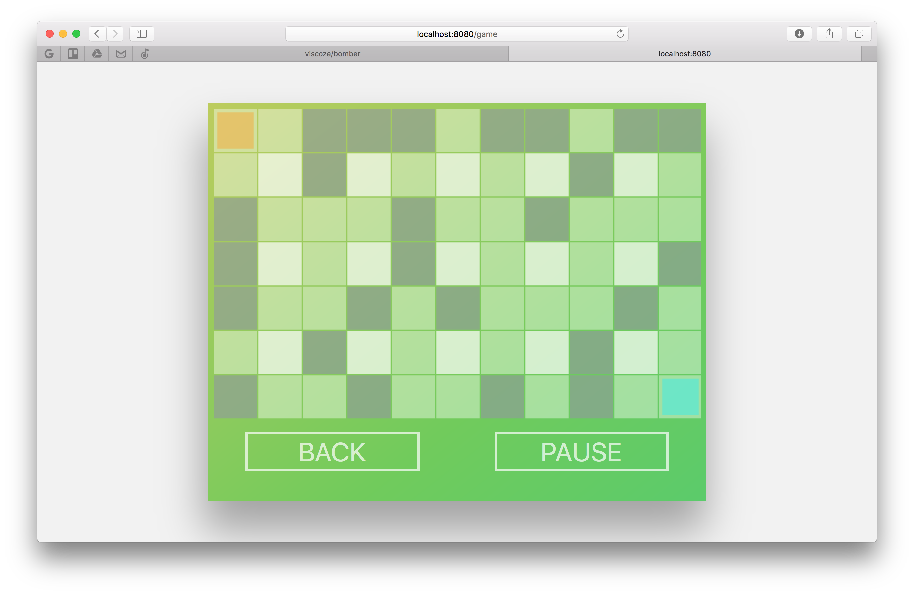

Bomber
=====================

Modern version of legendary Bomberman game.



### Objective

This project demonstrates that you can in short term create fancy game using React,
Redux and Canvas.

### Control

#### Orange Player

WASD - movement
F    - plant a bomb

#### Blue Player

IJKL - movement
;    - plant a bomb

### Usage
**Clone this repository**
```
git clone https://github.com/viscoze/bomber.git
```

**Install**
```
npm install
```

**Start the application in development mode**
```
npm start
```

Open http://localhost:8080 in your browser.

### Dependencies

* React & React-DOM
* Webpack & webpack-dev-server
* Babel Core
* Babel Loader (With "es2015" and "react" presets)

### License

Copyright 2016 Vlad Oganov.

All rights reserved.

Commercial and other use is not permitted, the source code is for educational purposes only.
